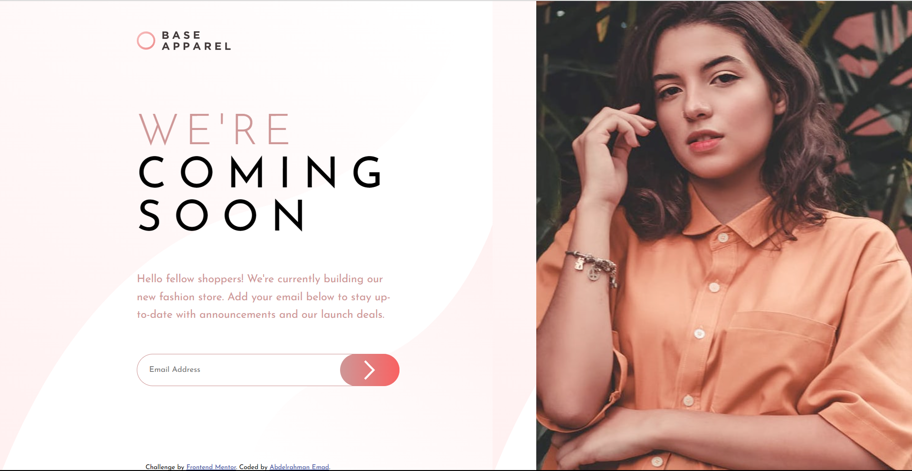
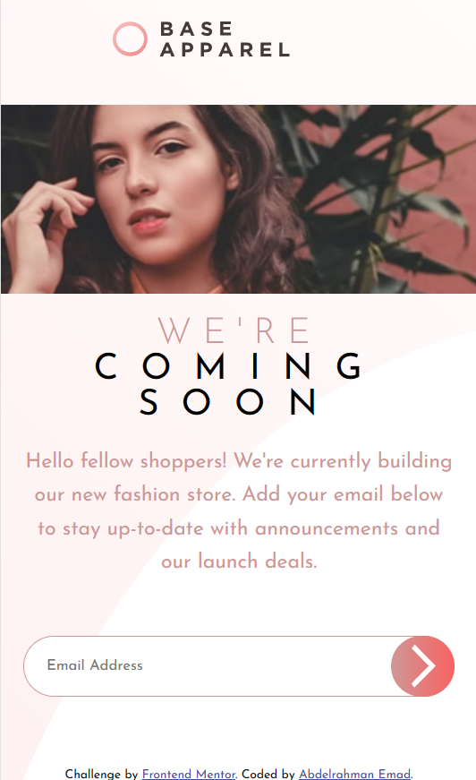

# Frontend Mentor - Base Apparel coming soon page solution

This is a solution to the [Base Apparel coming soon page challenge on Frontend Mentor](https://www.frontendmentor.io/challenges/base-apparel-coming-soon-page-5d46b47f8db8a7063f9331a0). Frontend Mentor challenges help you improve your coding skills by building realistic projects.

## Table of contents

- [Overview](#overview)
  - [The challenge](#the-challenge)
  - [Screenshot](#screenshot)
  - [Links](#links)
- [My process](#my-process)
  - [Built with](#built-with)
  - [What I learned](#what-i-learned)
  - [Continued development](#continued-development)
  - [Useful resources](#useful-resources)
- [Author](#author)
- [Acknowledgments](#acknowledgments)

## Overview

### The challenge

- View the optimal layout for the site depending on their device's screen size
- See hover states for all interactive elements on the page
- Receive an error message when the `form` is submitted if:
  - The `input` field is empty
  - The email address is not formatted correctly

### Screenshot

### Links

- Live Site URL: [live site URL](https://3omeed.github.io/base-apparel-coming-soon-master/)

## My process

### Built with

- Semantic HTML5 markup
- CSS custom properties
- - Flexbox
- - CSS Grid
- Mobile-first workflow
- JavaScript
- [Styled Components](https://styled-components.com/) - For styles

### What I learned

this is my first project with javascript code in it, feels very good and responsive
to have a dynamic challenge that, respond to client
I learned more about css flexbox properties and had a good experience about landmarks

### Useful resources

- [mdn](https://developer.mozilla.org/en-US/) - This helped me for javascript things to search for such as :
  adding error msg to the input.
  I really liked this pattern and will use it going forward.
- [w3 School](https://www.w3schools.com/) -I'd recommend it to anyone still learning this concept.

## Author

- Linkedin - [Abdelrahman Emad](https://www.linkedin.com/in/abdelrahman-emad-57bb10237/)
- Frontend Mentor - [@3omeed](https://www.frontendmentor.io/profile/yourusername)

## Acknowledgments

I want to give a big applause to @Mohamed-Waled who got my back in every situation or problem in my code
